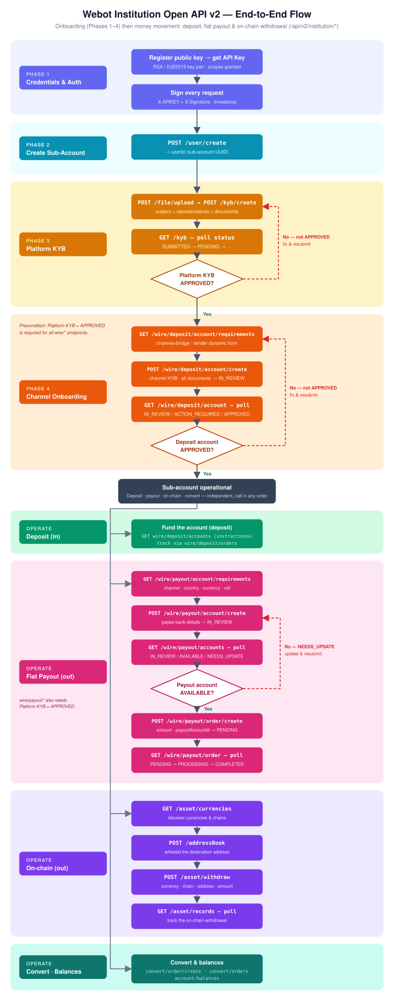
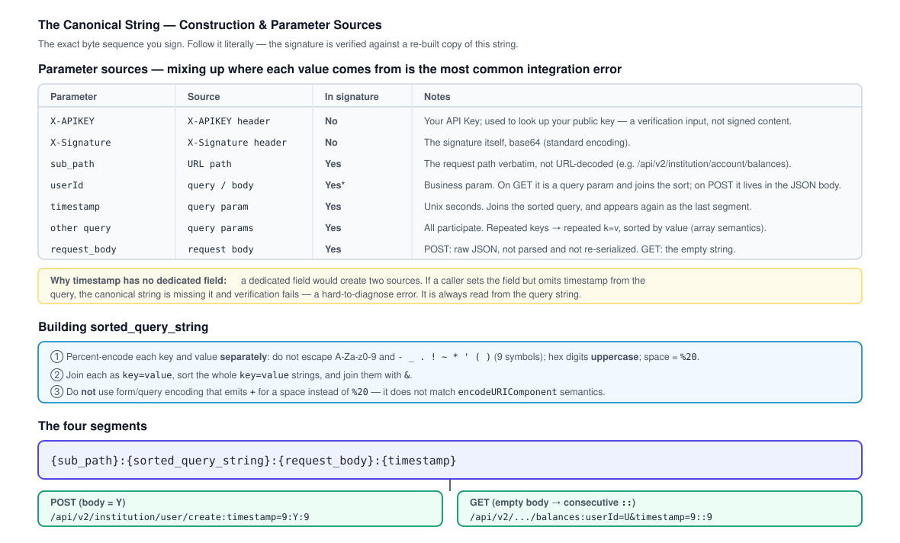

# Webot US Institution Open API Documentation (v2)

HTTP API reference for institutional service providers (`/api/v2/institution/*`). An institution uses **its own API Key (an RSA or Ed25519 key pair)** to onboard and operate the sub-accounts (`userId`) bound to it — fiat deposit/withdrawal, stablecoin conversion, on-chain assets, and trading-account balances.

> This is the **v2** institution reference. Unlike v1 ([webot-institution-openapi.md](./webot-institution-openapi.md)), v2 uses **public-key signature authentication** (RSA or Ed25519) and identifies the target sub-account by **`userId`** (a UUID) rather than `uid`. Authentication is documented in full below — v2 does **not** share the v1 authentication section.

## End-to-End Flow

The diagram below shows the full path from registering your public key to moving money on a sub-account. **Phases 1–4 are the onboarding spine** (sequential): [Authentication](#authentication) → [Create Sub-Account](#1-create-sub-account) → [Platform KYB](#kyb-endpoints) → [Channel Onboarding](#4-onboard-a-deposit-account-channel-kyb). Once the sub-account is operational, the money-movement flows are **independent capabilities you can call in any order**: [deposit](#deposit-endpoints), [fiat payout](#payout-endpoints) (create a payee account and wait for it to reach `AVAILABLE`, then submit the payout), [on-chain withdrawal](#asset-on-chain-endpoints) (whitelist an address, then withdraw), and [convert](#convert-endpoints) / [balances](#account-endpoints).



> **Key gate:** all `wire/*` endpoints require the target `userId`'s platform KYB to be `APPROVED` first — see the [KYB precondition](#kyb-endpoints).

## General Information

| | |
|---|---|
| Base URL | `https://api.webot.com` |
| Protocol | HTTPS |
| Data Format | JSON |
| Field Naming | camelCase (e.g. `userId`, `clientOrderId`) |
| Amounts | decimal strings (e.g. `"100.50"`) — never float, never minor-unit integers |
| Timestamps | millisecond Unix timestamp (`int64`) in **response bodies**; the signature `timestamp` query parameter is in **seconds** (see Authentication) |
| Currency codes | ISO 4217 uppercase (`"USD"`); country codes ISO 3166-1 alpha-2 uppercase (`"US"`) |

### Response Envelope

All endpoints return a uniform envelope.

**Success:**

```json
{ "result": true, "timestamp": 1785706000000, "data": { } }
```

**Failure:**

```json
{ "result": false, "timestamp": 1785706000000, "code": "P_PAY_OPEN_API_INVALID_ARGUMENT", "message": "..." }
```

Business failures are returned as HTTP `200` with `result: false`. The only two exceptions come from the authentication layer: `401` (authentication failed) and `400` (request body could not be read).

### Endpoint Summary

| Method | Path | Description |
|--------|------|-------------|
| POST | `/api/v2/institution/user/create` | Create a sub-account (user) |
| GET | `/api/v2/institution/users` | List sub-accounts |
| POST | `/api/v2/institution/kyb/create` | Submit platform KYB |
| GET | `/api/v2/institution/kyb` | Get platform KYB status |
| GET | `/api/v2/institution/wire/deposit/account/requirements` | Get channel onboarding requirements |
| POST | `/api/v2/institution/wire/deposit/account/create` | Onboard a deposit account (channel KYB) |
| GET | `/api/v2/institution/wire/deposit/account` | Get deposit-account onboarding status |
| GET | `/api/v2/institution/wire/deposit/accounts` | List deposit accounts |
| GET | `/api/v2/institution/wire/deposit/orders` | List deposit orders |
| GET | `/api/v2/institution/wire/deposit/order` | Get a deposit order |
| GET | `/api/v2/institution/wire/payout/account/requirements` | Get payout-account field requirements |
| POST | `/api/v2/institution/wire/payout/account/create` | Create a payout (payee) account |
| GET | `/api/v2/institution/wire/payout/accounts` | List payout accounts |
| POST | `/api/v2/institution/wire/payout/account/update` | Update a payout account |
| POST | `/api/v2/institution/wire/payout/account/delete` | Delete a payout account |
| POST | `/api/v2/institution/wire/payout/order/create` | Create a payout (fiat withdrawal) |
| GET | `/api/v2/institution/wire/payout/orders` | List payout orders |
| GET | `/api/v2/institution/wire/payout/order` | Get a payout order |
| GET | `/api/v2/institution/asset/currencies` | List currencies and chains |
| GET | `/api/v2/institution/asset/address` | Get an on-chain deposit address |
| POST | `/api/v2/institution/asset/withdraw` | Create an on-chain withdrawal |
| GET | `/api/v2/institution/asset/withdraw` | Query a single on-chain withdrawal |
| GET | `/api/v2/institution/asset/records` | Query deposit/withdrawal history |
| GET | `/api/v2/institution/addressBooks` | List address-book entries |
| POST | `/api/v2/institution/addressBook` | Add an address-book entry |
| POST | `/api/v2/institution/addressBook/delete` | Delete an address-book entry |
| GET | `/api/v2/institution/account/balances` | Get trading-account balances |
| POST | `/api/v2/institution/convert/order/create` | Create a conversion |
| GET | `/api/v2/institution/convert/orders` | List conversion orders |
| GET | `/api/v2/institution/convert/order` | Get a conversion order |
| POST | `/api/v2/institution/file/upload` | Upload a file (KYB / supporting documents) |
| GET | `/api/v2/institution/file/download` | Download a file |

---

## Authentication

Every request (except where noted) is authenticated with your institution API Key and a **signature**. Apply for an API Key by registering your **public key** with Webot; you keep the private key.

### Headers

| Header | Description |
|--------|-------------|
| `X-APIKEY` | Your API Key, in the form `webot_xxxxxxxx`. Used to look up your registered public key. |
| `X-Signature` | Base64 (standard encoding) of the signature over the canonical string below. |

### Signature algorithms

The algorithm is determined by the **type of public key you registered** — you do not choose it per request. Two key types are supported:

| Key type | How to sign | Notes |
|----------|-------------|-------|
| **RSA** | RSA-PSS over the **SHA-256** digest | 2048–4096-bit key. Salt length 32 recommended (20 / 32 / 64 all accepted). **Not** PKCS#1 v1.5. |
| **Ed25519** | Sign the message bytes **directly** | Do **not** pre-hash — EdDSA already includes SHA-512. |

- Register the public key in **PKIX/SPKI** form (`-----BEGIN PUBLIC KEY-----`). PKCS#1 "RSA PUBLIC KEY" and other algorithms (ECDSA, DSA, …) are not accepted.
- RSA reference: Go `rsa.SignPSS(rand, priv, crypto.SHA256, sha256(msg), nil)`; OpenSSL `-sigopt rsa_padding_mode:pss`.

### Required query parameter

| Parameter | Type | Description |
|-----------|------|-------------|
| `timestamp` | integer | Current time in **seconds** (Unix). Required on every signed request and participates in the signature. Must be within **±5 seconds** of server time, otherwise the request is rejected. |

> `timestamp` goes in the **query string** on every request, including `POST` (whose business payload is in the JSON body). There is **no** `client_id` / nonce parameter.

### Canonical string

Sign the following string:

```
{sub_path}:{sorted_query_string}:{request_body}:{timestamp}
```

| Segment | Construction |
|---------|--------------|
| `sub_path` | The request path, verbatim (not URL-encoded), e.g. `/api/v2/institution/account/balances`. |
| `sorted_query_string` | Percent-encode each key and value **separately** with `encodeURIComponent` semantics — do **not** escape `A-Za-z0-9 - _ . ! ~ * ' ( )`, hex digits uppercase, space is `%20` (do not use form-encoding, which emits `+`). Join each as `key=value`, then **sort the `key=value` strings** and join with `&`. Every query parameter participates — `timestamp` plus business params such as `userId`; repeated keys are kept and sorted by value. |
| `request_body` | For `POST` with a JSON body: the raw body, verbatim (not re-serialized). For `GET`: the empty string (so the canonical string shows `::`). |
| `timestamp` | The same seconds value, appended again at the end. |

**Examples:**

```
GET  (no body):   /api/v2/institution/account/balances:timestamp=1785706000&userId=88001234::1785706000
POST (JSON body): /api/v2/institution/kyb/create:timestamp=1785706000:{"userId":"88001234"}:1785706000
```

Then `X-Signature = base64( sign( canonical_string ) )`, sent together with `X-APIKEY`.

The diagram below summarizes where each parameter comes from, how `sorted_query_string` is built, and how the four segments concatenate. Mixing up a parameter's source is the most common integration error.



---

## Permissions (Scopes)

Each API Key is granted one or more **scopes** at registration (default: `read`). Every endpoint requires a scope; a request whose key lacks the required scope is rejected with `P_PAY_OPEN_API_PERMISSION_DENIED` and never reaches business logic.

- **Read** endpoints (the `GET` queries — balances, orders, records, requirements, status, lists) require read access.
- **State-changing** endpoints (`POST` create / submit / update / delete — sub-account and KYB onboarding, payouts, on-chain withdrawals, conversions, address-book and file writes) require the corresponding **write** scope.

Contact Webot to grant your key the scopes your integration needs; the scopes attached to a key cannot be changed by the caller.

---

## The `userId` Parameter

Except for public/self endpoints (create user, list users, `asset/currencies`), **every endpoint requires `userId`** — the UUID of the target sub-account:

- **GET requests:** pass `userId` in the query string (it participates in the signature);
- **POST requests with a JSON body:** pass `userId` in the JSON request body;
- **File upload** (`multipart/form-data`): pass `userId` in the query string.

Obtain `userId` values from [List Sub-Accounts](#2-list-sub-accounts) (or the response of [Create Sub-Account](#1-create-sub-account)).

---

## Error Codes

When `result` is `false` the response carries a top-level string `code`. The codes below may be returned by any endpoint; endpoint-specific codes are listed in each endpoint's **Errors** table. Codes have no numeric form.

| Error Code | Description |
|------------|-------------|
| `P_PAY_OPEN_API_INVALID_ARGUMENT` | A request parameter is missing or invalid. |
| `P_PAY_OPEN_API_UNAUTHENTICATED` | Authentication failed (missing key, bad signature, etc.). Returns HTTP `401`. |
| `P_PAY_OPEN_API_PERMISSION_DENIED` | Your API Key lacks permission for this endpoint. |
| `P_PAY_OPEN_API_NOT_FOUND` | Resource does not exist, or does not belong to this user. |
| `P_PAY_OPEN_API_ALREADY_EXISTS` | Resource already exists (e.g. address already in the address book). |
| `P_PAY_OPEN_API_SERVICE_UNAVAILABLE` | A dependency is temporarily unavailable; retry later. |
| `P_PAY_OPEN_API_TIMEOUT` | The request timed out; retry later. |
| `P_PAY_OPEN_API_INTERNAL_ERROR` | Internal error. |
| `P_PAY_OPEN_API_OPERATION_NOT_SUPPORTED` | The channel does not support this operation. Do not retry. |
| `P_PAY_OPEN_API_CHANNEL_NOT_SUPPORTED_IN_REGION` | The requested `channel` is not available for your integration. Do not retry with the same channel. |

### Wire channel error codes

`wire/*` endpoints surface an extra family of codes with the `P_PAY_OPEN_API_WIRE_` prefix, passed through from the underlying fiat channel when a request is rejected and **no order is created**. Once an order is created the call succeeds (`result: true`) and any later failure is reported through the order's `reason` object instead (see the payout order `reason.code` table). A given channel returns only the WIRE codes that apply to it.

The four codes below can come from **any** `wire/*` endpoint. The corridor-, account-, KYB-, and order-specific WIRE codes are listed in each endpoint's **Errors** table.

| Error Code | Description |
|------------|-------------|
| `P_PAY_OPEN_API_WIRE_INVALID_PARAMS` | Request parameters are invalid. |
| `P_PAY_OPEN_API_WIRE_SYSTEM_ERROR` | Channel-side system error; the result may be indeterminate — query by the original `clientOrderId` or retry unchanged. |
| `P_PAY_OPEN_API_WIRE_NO_AVAILABLE_CHANNEL` | `channel` was omitted and no channel could be selected for this user. |
| `P_PAY_OPEN_API_WIRE_CHANNEL_UNIMPLEMENTED` | The selected channel does not implement this capability. |

---

## User Endpoints

### 1. Create Sub-Account

Create a sub-account (user) bound to your institution. Idempotent by `clientId`.

```
POST /api/v2/institution/user/create
```

**Request Body (JSON):**

| Field | Type | Required | Description |
|-------|------|----------|-------------|
| clientId | string | Yes | Client-defined idempotency key, max 64 chars. Retries must reuse the same value. |
| email | string | Yes | Email, max 64 chars. |
| entityType | string | Yes | `CORPORATE` (business) / `INDIVIDUAL` (natural person). |
| remark | string | No | Note, max 100 chars. |

**Response Example:**

```json
{ "result": true, "timestamp": 1785706000000, "data": { "userId": "88001234-1a2b-..." } }
```

**Errors:**

| Error Code | Description |
|------------|-------------|
| `P_PAY_OPEN_API_SUB_USER_CREATE_FORBIDDEN` | Master account unavailable, caller is itself a sub-account (nesting unsupported), or sub-account limit reached. |
| `P_PAY_OPEN_API_SUB_USER_ACCOUNT_CREATE_FAILED` | The sub-account was created but not fully set up. `data.userId` returns the created id; resend the identical request to complete setup. |

### 2. List Sub-Accounts

```
GET /api/v2/institution/users
```

**Request Parameters:**

| Parameter | Type | Required | Description |
|-----------|------|----------|-------------|
| page | integer | No | Page number, starting from 1. |
| size | integer | No | Page size, default 100, max 500. |

**Response Example:**

```json
{
  "result": true,
  "timestamp": 1785706000000,
  "data": {
    "list": [
      { "userId": "88001234-...", "email": "a@example.com", "entityType": "CORPORATE", "status": "ACTIVE", "remark": "Client A", "createTime": 1785700000000 }
    ],
    "total": 1
  }
}
```

> `total` is the total count for pagination. An out-of-range page returns an empty `list` with the real `total`.

---

## KYB Endpoints

Onboarding is a **two-step** flow:

1. **Platform KYB** — submit company/representative information once via `POST /kyb/create`. It must reach status `APPROVED` before any channel deposit onboarding.
2. **Channel onboarding** — once platform KYB is approved, onboard a deposit account with a specific channel via `wire/deposit/account/*`.

> **Precondition:** all `wire/*` endpoints (channel deposit onboarding, deposit accounts/orders, payout accounts, payouts) require the `userId`'s **platform KYB to be `APPROVED`**. Otherwise `P_PAY_OPEN_API_INTERNAL_KYB_NOT_APPROVED` is returned.

### How to fill KYB fields

Platform KYB and channel KYB use **different** field sources — fill them accordingly.

#### Platform KYB fields (`POST /kyb/create`)

Platform KYB fields follow a **fixed, documented field list** — fill them according to this documentation, not by calling an endpoint. Every item has a **canonical key** in a flat key space:

- Subject (company) fields use the `subject.` prefix; each is one `{ "key": "...", "value": "..." }` under `subject.fields`.
- Each related natural person uses the `representative.` prefix; submit one entry per person under `representatives[]`, distinguished by the `representativeRef` property.
- Documents share the same key space (their key is the document's purpose) and carry a `fileId` — upload first (see [File Endpoints](#file-endpoints)), then reference by `fileId`.

The complete field list, required markers, formats, conditional rules, enums, and the document matrix are in **[Platform KYB Field Reference](#platform-kyb-field-reference)** below.

#### Channel KYB fields (`wire/deposit/account/*`)

> **`channel` currently supports only `Lead Bank`.**

Channel KYB fields are **dynamic** — **call `GET /wire/deposit/account/requirements` first**, then fill per the returned `Requirement` items. Do not hard-code channel field lists.

- **`mode`** is the source of truth for whether to submit an item: `REQUIRED` (must submit), `OPTIONAL`, or `CONDITIONAL`.
- **`CONDITIONAL`** means the item becomes required only when other fields take certain values; when unsure, submit it. The final decision rests with the channel.
- **`kind`** is `FIELD` or `DOCUMENT`. Documents are referenced by `fileId` (upload first — see [File Endpoints](#file-endpoints)); do not inline file bytes.
- Representatives are grouped by `representativeRef`; fill each representative's own `fields` / `documents`.
- `regex` / `example` / `enumValues` on a field are for client-side validation and hints.
- The requirements endpoint returns the items still required for the selected channel; information already provided is omitted. **Documents must be submitted in full.**

> The exact fields and documents each channel requires — with their formats — are returned by the requirements endpoint. Render your form from that response rather than hard-coding a list.

### 1. Submit Platform KYB

```
POST /api/v2/institution/kyb/create
```

**Request Body (JSON):**

| Field | Type | Required | Description |
|-------|------|----------|-------------|
| userId | string | Yes | Sub-account UUID. A `userId` has a single platform KYB application; resubmitting updates it while it is still under review. Once `APPROVED`, it can no longer be resubmitted. |
| subject | object | No | Subject fields: `{ "fields": [ { "key": "...", "value": "..." } ] }`. Keys are canonical keys. |
| representatives | object[] | No | Each: `{ "representativeRef": "...", "fields": [ ... ] }`. |
| documents | object[] | No | Each: `{ "purpose": "...", "fileId": "...", "scope": "SUBJECT|REPRESENTATIVE", "representativeRef": "..." }`. |

**Response Example:**

```json
{ "result": true, "timestamp": 1785706000000, "data": { "status": "SUBMITTED" } }
```

Validation (key validity + unconditional required + enum) passing returns `SUBMITTED`; otherwise `P_PAY_OPEN_API_INVALID_ARGUMENT` and nothing is stored. A `subject.country` other than `US` is rejected with `P_PAY_OPEN_API_COUNTRY_NOT_SUPPORTED_IN_REGION`; an unrecognized (non-ISO) country code is `P_PAY_OPEN_API_INVALID_ARGUMENT`.

**Errors:**

| Error Code | Description |
|------------|-------------|
| `P_PAY_OPEN_API_KYB_ALREADY_APPROVED` | Platform KYB is already `APPROVED` and can no longer be resubmitted. |
| `P_PAY_OPEN_API_KYB_SUBMIT_IN_PROGRESS` | A submission for this `userId` is already being processed; retry later. |
| `P_PAY_OPEN_API_COUNTRY_NOT_SUPPORTED_IN_REGION` | `subject.country` is a valid ISO code but not `US`. This API accepts US-registered companies only. |

### 2. Get Platform KYB Status

```
GET /api/v2/institution/kyb
```

**Request Parameters:** `userId` (string, required).

**Response Example:**

```json
{ "result": true, "timestamp": 1785706000000, "data": { "status": "APPROVED", "reason": "", "message": "" } }
```

| Field | Type | Description |
|-------|------|-------------|
| status | string | `SUBMITTED` / `PENDING` / `SUPPLEMENT_REQUIRED` / `APPROVED` / `REJECTED`. |
| reason | string | Review conclusion code; empty before review. |
| message | string | Conclusion description; empty before review. |

### 3. Get Channel Onboarding Requirements

Returns the items still required for channel onboarding. Information already provided is omitted. Representative requirements are returned per contact.

```
GET /api/v2/institution/wire/deposit/account/requirements
```

**Request Parameters:**

| Parameter | Type | Required | Description |
|-----------|------|----------|-------------|
| userId | string | Yes | Sub-account UUID. |
| channel | string | Yes | Channel identifier. Currently `Lead Bank`. |

> Do not pass `country` or `businessType` — the requirement set follows the values from your platform KYB (`subject.country` / `subject.businessType`).

**Response Fields (`data`):**

| Field | Type | Description |
|-------|------|-------------|
| subjectFields | Requirement[] | Subject fields still missing (what your platform KYB has not already provided). |
| subjectDocuments | Requirement[] | Subject documents still missing (flattened, one per purpose). |
| requiresRepresentatives | boolean | Whether representative info is required. |
| representatives | object[] | What each contact still needs, one entry per contact: `{ representativeRef, fields[], documents[] }`. Contacts already on file are returned **with their `representativeRef`** — reuse that value when submitting. If there is no contact yet, a single entry with an empty `representativeRef` and the full template is returned, to fill in your first contact. |
| fileLimit | object | `{ maxFileCount, maxFileBytes, maxTotalBytes, contentTypes[] }`. |
| tosMode | string | `NONE` / `HOSTED_LINK` / `INLINE_ACCEPT`. |
| tosUrl | string | Terms URL; empty when `NONE`. |
| termsVersion | string | Terms version; non-empty only for `INLINE_ACCEPT`. |
| requiresBusinessType | boolean | Whether a business type is still needed to refine the list. Always `false` in this API — the business type comes from platform KYB. |

`Requirement`: `{ key, kind, required, mode, label, regex, example, enumValues[], condition }`.

- `kind`: `FIELD` / `DOCUMENT`.
- `mode`: `KYB_REQUIREMENT_MODE_REQUIRED` / `KYB_REQUIREMENT_MODE_OPTIONAL` / `KYB_REQUIREMENT_MODE_CONDITIONAL`. Use `mode` to decide whether to submit an item. `required` is retained for backward compatibility; only fall back to it when `mode = KYB_REQUIREMENT_MODE_UNSPECIFIED`.
- `condition`: present for conditional requirements. It contains `{ logic, predicates[] }`; `logic` is `KYB_CONDITION_LOGIC_ALL` or `KYB_CONDITION_LOGIC_ANY`. Each predicate contains `{ fieldKey, operator, values[] }`, where `operator` is `KYB_CONDITION_OPERATOR_EQUALS`, `KYB_CONDITION_OPERATOR_NOT_EQUALS`, `KYB_CONDITION_OPERATOR_IN`, `KYB_CONDITION_OPERATOR_NOT_IN`, `KYB_CONDITION_OPERATOR_PRESENT`, or `KYB_CONDITION_OPERATOR_NOT_PRESENT`.

#### Lead Bank supplemental information

Platform KYB information is reused automatically. Lead Bank may still request the following channel-specific information when it is not available from platform KYB. Existing company formation documents and representative identity documents are also reused when available.

All values in `subject.fields[]` and `representatives[].fields[]` are strings. For boolean fields submit `"true"` or `"false"`; for multi-value fields submit a JSON-array string such as `"[\"522320\"]"`.

| Key | Req | Rules and description |
|-------|------|-----------------------|
| `subject.isDao` | Yes | Whether the business is a decentralized autonomous organization. Values: `true`, `false`. |
| `subject.primaryAccountPurpose` | No | Primary purpose for using the account. Use one value from the enum below. |
| `subject.accountPurposeOther` | Cond. | Required when `subject.primaryAccountPurpose = OTHER`; describe the other account purpose. |
| `subject.sourceOfFunds` | No | Main source of the business funds. Use one value from the enum below. |
| `subject.sourceOfFundsDescription` | No | Free-text details about the source of funds. |
| `subject.naicsCodes[]` | No | One or more NAICS 2022 industry codes encoded as a JSON-array string, for example `"[\"522320\"]"`. |
| `subject.customerTypesServed` | No | Types of customers served by the business. Use one value from the enum below. |
| `subject.highRiskActivities[]` | No | High-risk activities encoded as a JSON-array string. `NONE_OF_THE_ABOVE` cannot be combined with another value. |
| `subject.highRiskActivitiesExplanation` | No | Free-text details about the selected high-risk activities. |
| `representative.taxId.type` | Yes | Personal tax identifier type: `SSN` or `ITIN`. |
| `representative.taxId.number` | Yes | Personal tax identifier corresponding to `representative.taxId.type`. |
| `representative.role.beneficialOwner` | Yes | Whether this representative is a beneficial owner. Values: `true`, `false`. |
| `representative.role.controllingPerson` | Yes | Whether this representative is a controlling person. Values: `true`, `false`. |
| `representative.role.authorizedSignatory` | Yes | Whether this representative is authorized to sign for the business. Values: `true`, `false`. A person may have more than one role. |

**Lead Bank supplemental enum values:**

- `subject.primaryAccountPurpose`: `CHARITABLE_DONATIONS`, `ECOMMERCE_RETAIL_PAYMENTS`, `INVESTMENT_PURPOSES`, `OTHER`, `PAYMENTS_TO_FRIENDS_OR_FAMILY_ABROAD`, `PAYROLL`, `PERSONAL_OR_LIVING_EXPENSES`, `PROTECT_WEALTH`, `PURCHASE_GOODS_AND_SERVICES`, `RECEIVE_PAYMENTS_FOR_GOODS_AND_SERVICES`, `TAX_OPTIMIZATION`, `THIRD_PARTY_MONEY_TRANSMISSION`, `TREASURY_MANAGEMENT`.
- `subject.sourceOfFunds`: `BUSINESS_LOANS`, `GRANTS`, `INTER_COMPANY_FUNDS`, `INVESTMENT_PROCEEDS`, `LEGAL_SETTLEMENT`, `OWNERS_CAPITAL`, `PENSION_RETIREMENT`, `SALE_OF_ASSETS`, `SALES_OF_GOODS_AND_SERVICES`, `THIRD_PARTY_FUNDS`, `TREASURY_RESERVES`.
- `subject.customerTypesServed`: `INDIVIDUALS`, `BUSINESSES`, `BOTH`.
- `subject.highRiskActivities[]`: `ADULT_ENTERTAINMENT`, `GAMBLING`, `HOLD_CLIENT_FUNDS`, `INVESTMENT_SERVICES`, `LENDING_BANKING`, `MARIJUANA_OR_RELATED_SERVICES`, `MONEY_SERVICES`, `NICOTINE_TOBACCO_OR_RELATED_SERVICES`, `OPERATE_FOREIGN_EXCHANGE_VIRTUAL_CURRENCIES_BROKERAGE_OTC`, `PHARMACEUTICALS`, `PRECIOUS_METALS_PRECIOUS_STONES_JEWELRY`, `SAFE_DEPOSIT_BOX_RENTALS`, `THIRD_PARTY_PAYMENT_PROCESSING`, `WEAPONS_FIREARMS_AND_EXPLOSIVES`, `NONE_OF_THE_ABOVE`.
- `representative.taxId.type`: `SSN`, `ITIN`.

The table is a complete reference for the Lead Bank-only supplemental fields currently supported by this API. The requirements response remains authoritative for which fields must be rendered and submitted for a particular user; do not submit every field unconditionally.

### 4. Onboard a Deposit Account (Channel KYB)

Submit channel onboarding. Returns onboarding `status` only; missing/invalid items are not itemized — call the requirements endpoint to learn what is still missing.

```
POST /api/v2/institution/wire/deposit/account/create
```

**Request Body (JSON):**

| Field | Type | Required | Description |
|-------|------|----------|-------------|
| userId | string | Yes | Sub-account UUID. |
| channel | string | Yes | Channel. Currently `Lead Bank`; use the same channel as the requirements request. |
| signedAgreementId | string | Cond. | For `tosMode = HOSTED_LINK`. |
| acceptedTerms | boolean | Cond. | For `tosMode = INLINE_ACCEPT`. |
| termsVersion | string | Cond. | For `tosMode = INLINE_ACCEPT`. |
| subject | object | Cond. | `{ "fields": [ { "key", "value" } ] }`. Submit the subject fields returned by the requirements endpoint. |
| representatives | object[] | Cond. | `[ { "representativeRef", "fields": [...] } ]`. Required when `requiresRepresentatives = true`; reuse every non-empty `representativeRef` exactly. |
| documents | object[] | Cond. | **Provide all required documents in full every time.** Each item is `{ purpose, fileId, scope, representativeRef }`; required according to the requirements response. |

> Do not pass `country` or `businessType` here either — they come from your platform KYB. Any `fileId` you reference must belong to this `userId`.

#### Lead Bank hosted Terms of Service

When the requirements response returns `tosMode = HOSTED_LINK`:

1. Open the returned `tosUrl` in an iframe, WebView, or browser window.
2. Let the authorized representative complete the Lead Bank Terms of Service acceptance flow.
3. Obtain the agreement identifier either by listening for the hosted page's `postMessage` event containing `signedAgreementId`, or by adding a URL-encoded `redirect_uri` query parameter to `tosUrl` and reading `signed_agreement_id` from the redirect query.
4. Pass that value as `signedAgreementId` in this request.

Treat the full `tosUrl` and `signedAgreementId` as sensitive one-time flow data. Do not log or persist them.

**Response Example:**

```json
{ "result": true, "timestamp": 1785706000000, "data": { "status": "IN_REVIEW" } }
```

`status`: `NOT_CREATED` / `SUBMITTED` / `IN_REVIEW` / `ACTION_REQUIRED` / `APPROVED` / `REJECTED`.

**Errors:**

| Error Code | Description |
|------------|-------------|
| `P_PAY_OPEN_API_INTERNAL_KYB_NOT_APPROVED` | Platform KYB is not approved yet; it must be approved before channel onboarding. |
| `P_PAY_OPEN_API_WIRE_ADDRESS_REJECTED` | The customer address was rejected; `data.violations` names the rejected fields. |
| `P_PAY_OPEN_API_WIRE_CUSTOMER_INFO_REJECTED` | The customer information was rejected. |
| `P_PAY_OPEN_API_WIRE_SUBJECT_TYPE_CONFLICT` | The subject type (individual/company) conflicts with an existing one for this `userId`. |
| `P_PAY_OPEN_API_WIRE_KYB_OUTCOME_UNKNOWN` | The KYB outcome could not be determined; do not resubmit with altered details. |

Common and wire-common codes (see [Error Codes](#error-codes)) also apply.

### 5. Get Deposit-Account Onboarding Status

```
GET /api/v2/institution/wire/deposit/account
```

**Request Parameters:**

| Parameter | Type | Required | Description |
|-----------|------|----------|-------------|
| userId | string | Yes | Sub-account UUID. |
| channel | string | Yes | Channel. Currently `Lead Bank`. |

**Response Fields (`data`):**

| Field | Type | Description |
|-------|------|-------------|
| status | string | `NOT_CREATED` / `SUBMITTED` / `IN_REVIEW` / `ACTION_REQUIRED` / `APPROVED` / `REJECTED`. `NOT_CREATED` is a successful query result, not an error. |

Poll this endpoint after submission. `APPROVED` means the channel customer is ready for deposit-account and payout-account operations. For `ACTION_REQUIRED`, call the requirements endpoint again and resubmit the requested fields or documents.

---

## Platform KYB Field Reference

The canonical fields and documents accepted by `POST /kyb/create`. Applies to companies registered in the **United States (US)**.

### Required markers

| Marker | Meaning |
|--------|---------|
| **M** | Mandatory — a missing value fails validation (`P_PAY_OPEN_API_INVALID_ARGUMENT`). |
| **C** | Conditional — required when the trigger in the description holds. |
| **O** | Optional — providing it speeds up review; omitting it does not block. |

> The `Req` column gives the required marker. Files are submitted as `documents[]` with the document's canonical key as `purpose` and a `fileId`.

### Submission structure

```json
{
  "userId": "88001234-....",
  "subject": { "fields": [ { "key": "subject.legalNameEn", "value": "Acme Ltd." }, ... ] },
  "representatives": [ { "representativeRef": "PERSON-01", "fields": [ { "key": "representative.firstName", "value": "..." }, ... ] } ],
  "documents": [ { "purpose": "subject.sourceOfFundsProof", "fileId": "...", "scope": "SUBJECT" },
                 { "purpose": "representative.passport", "fileId": "...", "scope": "REPRESENTATIVE", "representativeRef": "PERSON-01" } ]
}
```

### 1. Subject fields (`subject.*`)

| Key | Req | Rules |
|-----|:--:|-------|
| `subject.country` | M | Registration jurisdiction. `US` only. Drives all validation. |
| `subject.legalNameEn` | M | Legal English name, ≤200. Must match the registration document exactly (incl. `Limited`/`Ltd.`/`Inc.` suffix). Non-Latin names need an official English translation. |
| `subject.registrationNo` | M | IRS EIN (format `XX-XXXXXXX`). ≤32. |
| `subject.registrationNoType` | M | `EIN`. |
| `subject.businessType` | M | Org form (enum §[Enums](#5-enums)). Also determines which charter document is required (see §[Documents](#2-subject-documents-subject)). |
| `subject.incorporationDate` | M | `yyyy-MM-dd`. Companies incorporated < 6 months may enter enhanced due diligence. |
| `subject.incorporationState` | M | US state code (e.g. `DE`, `CA`). |
| `subject.email` | M | Official business email, ≤128. A free-email domain (gmail/qq/163…) triggers manual review. |
| `subject.phone.countryCode` | C | Intl. dialing code without `+` (e.g. `1`). Required if phone is provided. |
| `subject.phone.number` | C | Required if phone is provided. ≤20. |
| `subject.website` | O | Must include scheme (`https://`), ≤256. Recommended for e-commerce/platform businesses. |
| `subject.registeredAddress.addressLine1` | M | Street + number, ≤200. **No P.O. Box**; must include a street number. |
| `subject.registeredAddress.addressLine2` | O | Room/floor/unit, ≤200. |
| `subject.registeredAddress.city` | M | ≤100. |
| `subject.registeredAddress.state` | M | 2-letter state code (e.g. `NY`). |
| `subject.registeredAddress.postalCode` | M | ZIP code. |
| `subject.registeredAddress.countryCode` | M | ISO 3166-1 alpha-2 (`US`). |
| `subject.operatingAddressSameAsRegistered` | M | `true` / `false`. When `true`, omit `operatingAddress`. |
| `subject.operatingAddress.*` | C | Same sub-fields as `registeredAddress`. Required when `operatingAddressSameAsRegistered = false`. |
| `subject.businessDescription` | M | Concrete description of products/services, ≤500. Vague terms ("trading", "consulting") are rejected for supplement. |
| `subject.accountPurpose.cryptoTrading` | O | `true`/`false`. At least one `accountPurpose.*` should be `true`. |
| `subject.accountPurpose.fiatDeposit` | O | `true`/`false`. |
| `subject.accountPurpose.fiatWithdrawal` | O | `true`/`false`. |
| `subject.accountPurpose.cardIssuing` | O | `true`/`false`. |
| `subject.accountPurpose.crossBorderPayment` | O | `true`/`false`. |
| `subject.accountPurpose.fxConversion` | O | `true`/`false`. |
| `subject.accountPurpose.payroll` | O | `true`/`false`. |
| `subject.accountPurpose.other` | O | `true`/`false`; describe in `businessDescription`. |
| `subject.monthlyDepositLimit.amount` | M | Decimal string, ≤2 decimals. Recommended in USD. |
| `subject.monthlyDepositLimit.currency` | M | ISO 4217. |
| `subject.monthlyWithdrawalLimit.amount` | M | Decimal string, ≤2 decimals. |
| `subject.monthlyWithdrawalLimit.currency` | M | ISO 4217. |
| `subject.pepDeclaration.hasPepRelation` | M | `true`/`false`. Whether any director/shareholder/UBO (or close relation) is/was a politically exposed person. |
| `subject.pepDeclaration.description` | C | Required when `hasPepRelation = true`, ≤500. Names, positions, tenure. |
| `subject.ownershipDeclaration.hasShareholderOver25Percent` | C | `true`/`false`. Required when no document evidencing the ownership structure is submitted. When `true`, `representatives[]` must include at least one person with `role.responsibility = ULTIMATE_BENEFICIAL_OWNER`. |
| `subject.ownershipDeclaration.hasNomineeShareholder` | O | `true`/`false`. If `true`, disclose the ultimate beneficial owner. |
| `subject.highRiskCountryExposure.involved` | O | `true`/`false`. Whether business touches FATF high-risk jurisdictions. |
| `subject.highRiskCountryExposure.description` | C | Required when `involved = true`, ≤500. |
| `subject.termsAgreed` | M | Must be `true`, else the application is rejected. |
| `subject.dataUsageAgreed` | M | Must be `true` (authorizes third-party data verification). |
| `subject.serviceAgreementType` | M | `FULL` / `RECIPIENT` (enum §[Enums](#5-enums)). |
| `subject.signerPersonRefId` | M | Must equal the `representativeRef` of the person designated as the authorized signer. |
| `subject.agreedAt` | M | ISO 8601 (e.g. `2026-08-25T10:12:33Z`). |
| `subject.deviceData.ipAddress` | M | Signer's public IP at consent time (IPv6-compatible), ≤45. |
| `subject.deviceData.userAgent` | M | Signer's User-Agent, ≤512. |

### 2. Subject documents (`subject.*`)

Value is a `fileId`. Required matrix:

| Key | Req | Notes |
|-----|:--:|-------|
| `subject.businessFormation` | M | Certificate of Incorporation (issued by the Secretary of State). |
| `subject.einConfirmationLetter` | M | IRS EIN confirmation letter (CP575 / 147C). |
| `subject.bylaws` | C | Charter — when `businessType` is a corporation subtype (`B_CORPORATION` / `C_CORPORATION` / `CLOSE_CORPORATION` / `S_CORPORATION`). **Note 3**. |
| `subject.operatingAgreement` | C | Charter — when `businessType = LLC`, or the merged fallback when `businessType` is not provided. **Note 3**. |
| `subject.partnershipAgreement` | C | Charter — when `businessType = LLP` / `LP` / `GENERAL_PARTNERSHIP`. **Note 3**. |
| `subject.registerOfDirectors` | C | Register of directors. **Note 1**. |
| `subject.ownershipProof` | C | Register of shareholders. **Note 1**. |
| `subject.shareholdingStructureChart` | C | Shareholding structure chart. **Note 1, Note 2**. |
| `subject.certificateOfGoodStanding` | O | Certificate of good standing. |
| `subject.financialStatements` | O | Financial statements. |
| `subject.authorizationLetter` | O | Authorization letter. |
| `subject.sourceOfFundsProof` | M | Source-of-funds proof — see **Note 4**. |
| `subject.supportiveOther` | O | Other supporting materials. |
| `subject.bankStatement` | O | Address proof: bank statement. |
| `subject.utilityBill` | O | Address proof: utility bill. |
| `subject.leaseAgreement` | O | Address proof: lease agreement. |
| `subject.taxNotice` | O | Address proof: tax authority notice. |
| `subject.addressProofOther` | O | Address proof: other. |

**Conditional rules:**

- **Note 1 (ownership & directors):** submit at least one of `registerOfDirectors` / `ownershipProof` / `shareholdingStructureChart` that fully shows directors and ownership. If already evidenced by the charter document, it may be omitted, and `subject.ownershipDeclaration.*` may then also be omitted.
- **Note 2:** if none of the above shows the full ownership chain (e.g. multi-tier holding), `shareholdingStructureChart` will be requested via supplement.
- **Note 3 (charter):** submit the charter document matching `businessType` — corporation subtypes (`B_CORPORATION` / `C_CORPORATION` / `CLOSE_CORPORATION` / `S_CORPORATION`) → `bylaws`; `LLC` → `operatingAgreement`; `LLP` / `LP` / `GENERAL_PARTNERSHIP` → `partnershipAgreement`. Only one, matching the true org form. (`operatingAgreement` also serves as the fallback when the specific charter type is unclear.)
- **Note 4 (source of funds):** mandatory. Acceptable forms include recent 6-month corporate bank statements, audited financials, key trade contracts + invoices, capital-contribution proof, or investment agreements + receipts. Multiple entries allowed (at least one). An account-balance screenshot alone is insufficient — the funds' formation chain must be shown.

**Address proof:** required when `operatingAddressSameAsRegistered = false`, or when the submitted registration documents do not state an address. Provide via the `subject.bankStatement` / `utilityBill` / `leaseAgreement` / `taxNotice` / `addressProofOther` keys; issued within the last 3 months.

### 3. Representative fields (`representative.*`)

One set per person, distinguished by the `representativeRef` property (see [Submission structure](#submission-structure)). Note: the per-person id is the `representativeRef` property of each `representatives[]` entry, **not** a `fields[]` key.

| Key | Req | Rules |
|-----|:--:|-------|
| `representativeRef` *(property — not a `fields[]` key)* | M | Stable per-person id in your system; keep unchanged across supplements. Supplied as the `representativeRef` property of each `representatives[]` entry (see [Submission structure](#submission-structure)) — do **not** place it inside `fields`. `subject.signerPersonRefId` references this value. |
| `representative.role.responsibility` | O | The person's responsibility relative to the company — **single value** from the enum (§[Enums](#5-enums)): `ULTIMATE_BENEFICIAL_OWNER` / `AUTHORIZED_REPRESENTATIVE` / `DIRECTOR`. |
| `representative.firstName` | M | English first name, ≤100. Must match the ID exactly. |
| `representative.middleName` | O | English middle name, ≤100. Provide if present on the ID. |
| `representative.lastName` | M | English last name, ≤100. Must match the ID exactly. |
| `representative.jobTitle` | M | Title (e.g. Director, CEO), ≤100. |
| `representative.birthDate` | M | `yyyy-MM-dd`. Must match the ID; must be ≥ 18 years old. |
| `representative.nationality` | M | ISO 3166-1 alpha-2. |
| `representative.ownershipPercentage` | C | Required when `role.responsibility = ULTIMATE_BENEFICIAL_OWNER`. `0.01`–`100`, ≤2 decimals; look-through actual percentage. |
| `representative.residentialAddress.addressLine1` | M | Actual residential address (not temporary), ≤200. |
| `representative.residentialAddress.addressLine2` | O | ≤200. |
| `representative.residentialAddress.city` | M | ≤100. |
| `representative.residentialAddress.state` | M | 2-letter state code. |
| `representative.residentialAddress.postalCode` | M | ZIP code. |
| `representative.residentialAddress.countryCode` | M | ISO 3166-1 alpha-2. |
| `representative.email` | M | Required for every person, ≤128 (used for verification-code delivery). |
| `representative.phone.countryCode` | O | Recommended for the primary contact person. |
| `representative.phone.number` | O | Recommended for the primary contact person. |
| `representative.identityDocument.ssn` | M | Personal tax id (SSN/ITIN) for every person. |
| `representative.identityDocument.idType` | M | Enum §[Enums](#5-enums). |
| `representative.identityDocument.idNumber` | M | ≤64. |
| `representative.identityDocument.issuingCountry` | M | ISO 3166-1 alpha-2. |
| `representative.identityDocument.issueDate` | O | `yyyy-MM-dd`. |
| `representative.identityDocument.expiryDate` | M | `yyyy-MM-dd`. Long-validity IDs use `9999-12-31`. An already-expired ID fails validation. |
| `representative.ownershipAttestedAt` | C | ISO 8601. Required when `subject.ownershipDeclaration.hasShareholderOver25Percent` has a value. |

### 4. Representative documents (`representative.*`)

Value is a `fileId`. ID-document files are routed by `identityDocument.idType` (see the Role/ID enum below).

| Key | Req | Notes |
|-----|:--:|-------|
| `representative.passport` | C | Passport photo page (front only) — when `idType = PASSPORT`. |
| `representative.idCardFront` / `representative.idCardBack` | C | Both required for card-style IDs — see the idType routing note in §[Enums](#5-enums). |
| `representative.driversLicenseFront` / `representative.driversLicenseBack` | C | Both required when `idType = DRIVERS_LICENSE`. |
| `representative.taxIdDocument` | C | Tax-id proof (SSN / ITIN); provide together with `representative.identityDocument.ssn` for US persons. |
| `representative.proofOfAddress` | C | Required when the residential address differs from the ID's stated address. |
| `representative.photoHoldingId` | O | Requested by risk control when fraud is suspected. |
| `representative.liveSelfie` | O | As above. |
| `representative.appointmentDocument` | O | Appointment/authorization document. |
| `representative.nameChangeCertificate` | C | Required when the ID name differs from the declared name. |
| `representative.supportiveOther` | O | Other supporting materials. |

### 5. Enums

Values below are the exact accepted values. The subset actually allowed for a given channel/country is returned by the requirements flow — do not assume every value is accepted everywhere.

**`subject.country`**: `US`.

**`subject.registrationNoType`**: `EIN`.

**`subject.businessType`** (single list — not split by jurisdiction):
`B_CORPORATION`, `C_CORPORATION`, `CLOSE_CORPORATION`, `S_CORPORATION`, `LLC`, `LLP`, `LP`, `GENERAL_PARTNERSHIP`, `SOLE_PROPRIETOR`, `TRUST`, `COOPERATIVE`, `NONPROFIT_CORPORATION`, `OTHER`.

> `OTHER` requires an accompanying description. The subset offered per channel/country is returned by requirements.

**`subject.serviceAgreementType`**: `FULL` (direct service relationship), `RECIPIENT` (payee only, no direct relationship).

**`representative.role.responsibility`** (single value): `ULTIMATE_BENEFICIAL_OWNER`, `AUTHORIZED_REPRESENTATIVE`, `DIRECTOR`.

**`representative.identityDocument.idType`**: `PASSPORT`, `DRIVERS_LICENSE`, `NATIONAL_ID`, `STATE_OR_PROVINCIAL_ID`, `PERMANENT_RESIDENCY_ID`, `MATRICULATE_ID`, `MILITARY_ID`, `VISA`.

> **ID-document files by `idType`:** `PASSPORT` → `passport`; `DRIVERS_LICENSE` → `driversLicenseFront` + `driversLicenseBack`; all other government IDs (`NATIONAL_ID`, `STATE_OR_PROVINCIAL_ID`, `PERMANENT_RESIDENCY_ID`, `MATRICULATE_ID`, `MILITARY_ID`, `VISA`) → `idCardFront` + `idCardBack`.

**Address proof** (which `subject.*` document key to use): bank statement → `bankStatement`; utility bill → `utilityBill`; lease → `leaseAgreement`; tax notice → `taxNotice`; other → `addressProofOther`.

### 6. File limits

| Limit | Value |
|-------|-------|
| Max file count per submission | 30 |
| Max bytes per file | 12,582,912 (12 MB) |
| Max total bytes per submission | 104,857,600 (100 MB) |
| Allowed content types | `application/pdf`, `image/jpeg`, `image/png`, `image/heic` |

### 7. Role integrity & cross-field rules

Submission is rejected with `P_PAY_OPEN_API_INVALID_ARGUMENT` when any of the following fails:

- **Registration type:** `registrationNoType = EIN`.
- **Incorporation state present:** `subject.incorporationState` is required.
- **Operating address present** when `operatingAddressSameAsRegistered = false`.
- **Every representative has an `email`.**
- **Beneficial owner ownership:** when `subject.ownershipDeclaration.hasShareholderOver25Percent = true` (or an ownership document shows a ≥25% holder), at least one representative must have `role.responsibility = ULTIMATE_BENEFICIAL_OWNER`. Each such person's `ownershipPercentage` must be in `(0, 100]`, and the sum must not exceed 100.
- **ID not expired**; ID **back** file present for card-style IDs and `DRIVERS_LICENSE`.
- **Age ≥ 18** (from `birthDate`).
- **Charter document matches `businessType`** (see Note 3).
- **Personal tax id present** (`representative.identityDocument.ssn`) for every representative.
- **Required company documents present** per the matrix; source-of-funds proof present; ownership information resolvable (either an ownership document or `subject.ownershipDeclaration.*`).
- **Consents accepted:** `termsAgreed` and `dataUsageAgreed` are `true`.

---

## Wire Endpoint Conventions

- The target `userId` must have platform KYB status `APPROVED`; otherwise `P_PAY_OPEN_API_INTERNAL_KYB_NOT_APPROVED` is returned.
- Where `channel` is optional, the service routes by the user's existing Lead Bank relationship. It fails if no channel can be selected; it does not silently create a new relationship.
- `country` and `currency` use uppercase ISO codes, for example `US` and `USD`. Amounts are decimal strings, never JSON numbers.
- `reason` has the shape `{ code, message, retryable }`. Branch on the stable `code`; use `message` only for display.
- Rejection before an order is created returns `result: false`. If an order exists but its business outcome is failed or returned, the API call returns `result: true` with the order status and `reason`.

Request-level channel failures (no order created) are surfaced under the `P_PAY_OPEN_API_WIRE_` prefix; see [Error Codes](#error-codes) for the full set. Once an order is created the call succeeds and the outcome is reported through the order `status` and `reason` (see the payout order `reason.code` table).

---

## Deposit Endpoints

### 1. List Deposit Accounts

```
GET /api/v2/institution/wire/deposit/accounts
```

**Request Parameters:**

| Parameter | Type | Required | Description |
|-----------|------|----------|-------------|
| userId | string | Yes | Sub-account UUID. |
| channel | string | Yes | Channel to query. Currently `Lead Bank`. |
| currency | string | No | Currency filter. Currently `USD`. |
| page | integer | No | Page number, starting from `1`; default `1`. |
| size | integer | No | Page size; default `20`, maximum `100`. |

**Response Fields:** `{ list: DepositAccount[], total }`. An empty `list` means no deposit account is currently available.

| `DepositAccount` field | Type | Description |
|------------------------|------|-------------|
| channel | string | Actual channel. |
| accountId | string | Channel virtual-account identifier. |
| currency | string | Account currency. |
| status | string | `PENDING` / `ACTIVE` / `UNAVAILABLE` / `CLOSED`. Only `ACTIVE` is remittable. |
| channelStatus | string | Raw channel status for diagnostics; do not branch on it. |
| instructions | FundingInstruction[] | Bank transfer instructions. Use an entry whose `rails` contains the intended rail. |
| feeAmount | string | Fixed fee charged per deposit, denominated in `currency`. |
| minDepositAmount | string | Minimum normal-processing amount; smaller deposits may require manual handling. |
| maxDepositAmount | string | Maximum amount; empty means no configured maximum. |

Each `FundingInstruction` contains `{ rails[], message, bankName, bankAddress, accountNumber, routingCode, routingCodeAlternate, swiftBic, accountHolderName, accountHolderAddress, reference, channelExtra[] }`. Copy `reference` and `channelExtra` exactly. Lead Bank rail values are `ach`, `wire`, and `fednow`.

**Errors:**

| Error Code | Description |
|------------|-------------|
| `P_PAY_OPEN_API_WIRE_UNSUPPORTED_CORRIDOR` | `currency` was supplied but is not `USD`. |

Common and wire-common codes (see [Error Codes](#error-codes)) also apply.

### 2. List Deposit Orders

```
GET /api/v2/institution/wire/deposit/orders
```

**Request Parameters:**

| Parameter | Type | Required | Description |
|-----------|------|----------|-------------|
| userId | string | Yes | Sub-account UUID. |
| channel | string | No | Channel filter. Currently `Lead Bank`; if omitted, routes by the user's existing Lead Bank relationship. |
| currency | string | No | Currency filter. Currently `USD`. |
| status | string | No | `PENDING` / `CREDITED` / `COMPLETED` / `FAILED` / `CANCELED`; omit for all. |
| startTime | integer | No | Inclusive creation-time lower bound, millisecond Unix timestamp. |
| endTime | integer | No | Exclusive upper bound; must be greater than `startTime`. |
| page | integer | No | Page number, starting from `1`; default `1`. |
| size | integer | No | Page size; default `20`, maximum `100`. |

**Response Fields:** `list[]` of `DepositOrder`, plus `total`.

**Errors:**

| Error Code | Description |
|------------|-------------|
| `P_PAY_OPEN_API_WIRE_UNSUPPORTED_CORRIDOR` | `currency` was supplied but is not `USD`. |

Common and wire-common codes (see [Error Codes](#error-codes)) also apply. `channel` may be omitted here, so `P_PAY_OPEN_API_WIRE_NO_AVAILABLE_CHANNEL` / `P_PAY_OPEN_API_WIRE_CHANNEL_UNIMPLEMENTED` can be returned when no channel can be selected.

### 3. Get a Deposit Order

```
GET /api/v2/institution/wire/deposit/order
```

**Request Parameters:**

| Parameter | Type | Required | Description |
|-----------|------|----------|-------------|
| userId | string | Yes | Sub-account UUID. |
| orderId | string | Yes | Deposit order ID. |
| channel | string | Yes | Channel that owns the order. Currently `Lead Bank`. |

**Response Example:**

```json
{
  "result": true,
  "timestamp": 1785706000000,
  "data": {
    "orderId": "d-9", "channel": "Lead Bank", "creditCurrency": "USDT",
    "receivedCurrency": "USD", "receivedAmount": "100", "feeAmount": "1",
    "creditAmount": "99", "status": "COMPLETED", "rail": "wire", "rate": "1",
    "createdAt": 1785700000000, "updatedAt": 1785700100000,
    "creditedAt": 1785700050000, "completedAt": 1785700100000
  }
}
```

`DepositOrder` fields:

| Field | Type | Description |
|-------|------|-------------|
| orderId | string | Webot deposit order ID. |
| channel | string | Actual channel. |
| receivedCurrency / receivedAmount | string | Currency and amount received from the bank/channel. |
| feeAmount | string | Fee deducted before crediting, in `receivedCurrency`. |
| creditCurrency / creditAmount | string | Currency and amount credited to the sub-account. |
| rate | string | `receivedCurrency` to `creditCurrency` conversion rate; `1` for the same currency. |
| status | string | Normalized deposit status described below. |
| rail | string | Actual deposit rail when known. |
| reason | Reason | Structured failure, return, or review reason when applicable. |
| createdAt / updatedAt | integer | Millisecond Unix timestamps. |
| creditedAt | integer | Credit time; `0` before crediting. |
| completedAt | integer | Settlement-complete time; `0` before completion. |

`status` is `PENDING` (processing), `CREDITED` (credited but not settled), `COMPLETED`, `FAILED`, or `CANCELED`. `reason` is normally absent and is present for a failure, return, or manual-review outcome. All time fields are millisecond Unix timestamps; `creditedAt` and `completedAt` are `0` until those events occur.

**Errors:**

| Error Code | Description |
|------------|-------------|
| `P_PAY_OPEN_API_WIRE_RESOURCE_NOT_FOUND` | No order exists for this `userId`, `channel`, and `orderId`. |

Common and wire-common codes (see [Error Codes](#error-codes)) also apply.

---

## Payout Account Endpoints

### 1. Get Payout-Account Field Requirements

Returns the required fields for a payout (payee) account, driven by channel + country + currency + rail.

```
GET /api/v2/institution/wire/payout/account/requirements
```

**Request Parameters:**

| Parameter | Type | Required | Description |
|-----------|------|----------|-------------|
| userId | string | Yes | Sub-account UUID. |
| channel | string | No | Requested channel. Currently `Lead Bank`; if omitted, routes by the user's existing Lead Bank relationship. |
| country | string | Yes | Destination bank country, ISO 3166-1 alpha-2. Lead Bank requires `US`. |
| currency | string | Yes | Destination account currency, ISO 4217. Currently `USD`. |
| rail | string | No | Lead Bank accepts omitted or `ach_same_day`. |

**Response Fields:** `{ channel, requirements[] }`.

| `FieldRequirement` field | Type | Description |
|--------------------------|------|-------------|
| key | string | Canonical field key to submit. |
| label | string | Human-readable field label. |
| required | boolean | Whether the field must be submitted for this corridor. |
| regex | string | Client-side validation pattern; empty means no additional pattern. |
| isExtra | boolean | When `true`, submit the key/value through `spec.channelExtra`; otherwise use the matching first-level `spec` field. |
| kind | string | Lead Bank currently returns an empty value, which is treated as `FIELD`; it does not return document requirements for this endpoint. |

For requirements with `isExtra = false`, use the following create request fields:

| Requirements response key | Create request field |
|---------------------------|----------------------|
| `account_holder_name` | `spec.accountHolderName` |
| `account_holder_address` | `spec.accountHolderAddress` |
| `bank_name` | `spec.bankName` |
| `routing_number` | `spec.routingNumber` |
| `account_number` | `spec.accountNumber` |
| `account_type` | `spec.accountType` |
| `file_ids` | `spec.fileIds` |

The response is authoritative for which account-detail fields are required. The current Lead Bank corridor is:

| Channel | country | currency | rail |
|---------|---------|----------|------|
| `Lead Bank` | `US` | `USD` | `ach_same_day` (may be omitted) |

**Errors:**

| Error Code | Description |
|------------|-------------|
| `P_PAY_OPEN_API_WIRE_UNSUPPORTED_CORRIDOR` | The `country` / `currency` / `rail` combination is not supported (Lead Bank requires `US` + `USD`, and either no rail or `ach_same_day`). |

Common and wire-common codes (see [Error Codes](#error-codes)) also apply. `channel` may be omitted here.

### 2. Create Payout Account

```
POST /api/v2/institution/wire/payout/account/create
```

**Request Body (JSON):**

| Field | Type | Required | Description |
|-------|------|----------|-------------|
| userId | string | Yes | Sub-account UUID. |
| clientAccountId | string | Yes | Idempotency key, unique within the same `userId`, 1–64 characters. Retries of the same account-creation request must reuse the original value. |
| channel | string | Yes | Use `Lead Bank`. |
| spec | object | Yes | Payout bank-account details described below. |

**`spec` fields:**

| Field | Type | Required | Description |
|-------|------|----------|-------------|
| currency | string | Yes | `USD`; must match the requirements request. |
| country | string | Yes | `US`; must match the requirements request. |
| rail | string | No | Omit it or use `ach_same_day`. |
| holderType | string | Yes | `ACCOUNT_HOLDER_TYPE_INDIVIDUAL` for a personal KYC subject or `ACCOUNT_HOLDER_TYPE_BUSINESS` for a company KYB subject. |
| accountHolderName | string | Yes | Approved KYC full name for a personal subject or approved KYB legal name for a company subject. Matching is case-insensitive after trimming surrounding whitespace. |
| accountHolderAddress | object | Yes | Billing address registered on the bank account; it should match the account-ownership proof. |
| bankName | string | Yes | Destination bank name. |
| routingNumber | string | Yes | US ABA routing number, exactly 9 digits. |
| accountNumber | string | Yes | Destination bank account number. |
| accountType | string | Yes | `BANK_ACCOUNT_TYPE_CHECKING` or `BANK_ACCOUNT_TYPE_SAVINGS`. |
| fileIds | string[] | Yes | Account-ownership proof: 1–5 file IDs returned by `POST /api/v2/institution/file/upload`, each at most 128 characters. Submit the returned values unchanged. |
| channelExtra | object[] | No | Key/value entries. Not used by Lead Bank; omit it. |

`accountHolderAddress` fields for Lead Bank:

| Field | Type | Required | Description |
|-------|------|----------|-------------|
| line1 | string | Yes | Street and number only, 4–35 characters; do not repeat city or state. P.O. Box and PMB addresses are not accepted. |
| line2 | string | No | Unit, suite, floor, etc., at most 35 characters. P.O. Box and PMB addresses are not accepted. |
| city | string | Yes | City. |
| stateProvinceRegion | string | Yes | Two-letter US state code, for example `CA`; normalized to uppercase. |
| postalCode | string | Yes | US postal code. |
| country | string | Yes | `US`. |

**Lead Bank company-account example:**

```json
{
  "userId": "88001234-....",
  "clientAccountId": "PA-20260917-0001",
  "channel": "Lead Bank",
  "spec": {
    "currency": "USD",
    "country": "US",
    "rail": "ach_same_day",
    "holderType": "ACCOUNT_HOLDER_TYPE_BUSINESS",
    "accountHolderName": "Acme Corporation",
    "accountHolderAddress": {
      "line1": "700 Lakeview Ave",
      "line2": "Suite 200",
      "city": "Seattle",
      "stateProvinceRegion": "WA",
      "postalCode": "98101",
      "country": "US"
    },
    "bankName": "Example Bank",
    "routingNumber": "021000021",
    "accountNumber": "100000012345",
    "accountType": "BANK_ACCOUNT_TYPE_CHECKING",
    "fileIds": ["file-id-from-upload-response"]
  }
}
```

**Response:** a `PayoutAccount` object (see below).

**Errors:**

| Error Code | Description |
|------------|-------------|
| `P_PAY_OPEN_API_WIRE_KYC_REQUIRED` | The individual KYC, company KYB, or Lead Bank customer is not ready yet. |
| `P_PAY_OPEN_API_WIRE_UNSUPPORTED_CORRIDOR` | The account corridor is not supported (Lead Bank requires `US` + `USD` + `ach_same_day`). |

Common and wire-common codes (see [Error Codes](#error-codes)) also apply. A `spec` field or bank-field validation failure returns `P_PAY_OPEN_API_WIRE_INVALID_PARAMS`.

### 3. List Payout Accounts

```
GET /api/v2/institution/wire/payout/accounts
```

**Request Parameters:**

| Parameter | Type | Required | Description |
|-----------|------|----------|-------------|
| userId | string | Yes | Sub-account UUID. |
| channel | string | No | Channel filter. Currently `Lead Bank`; if omitted, routes by the user's existing Lead Bank relationship. |
| currency | string | No | Currency filter. Currently `USD`. |
| page | integer | No | Page number, starting from `1`; default `1`. |
| size | integer | No | Page size; default `20`, maximum `100`. |

**Response Fields:** `list[]` of `PayoutAccount`, plus `total`.

Each `PayoutAccount` contains:

| Field | Type | Description |
|-------|------|-------------|
| accountId | string | Channel account identifier; pass this as `payoutAccountId`. |
| channel | string | Actual channel. |
| status | string | Normalized status from the table below. |
| rejectReason | Reason | Structured rejection/update reason when available. |
| accountLast4 | string | Last four characters of the account number. |
| bankName | string | Destination bank name. |
| currency | string | Account currency. |
| country | string | Bank country. |
| rail | string | Account payout rail. |
| accountHolderName | string | Name on the bank account. |
| createdAt / updatedAt | integer | Millisecond Unix timestamps. |
| editableFields | string[] | Exact fields accepted by the update endpoint. |

| status | Meaning |
|--------|---------|
| `IN_REVIEW` | Submitted and awaiting channel or manual review. |
| `AVAILABLE` | Approved and usable for payout. |
| `NEEDS_UPDATE` | Rejected information can be corrected; submit only fields listed in `editableFields`. |
| `UNAVAILABLE` | Not usable for payout. |
| `DELETED` | Deleted. |

`rejectReason` is present when a reason is available. Only use an `accountId` whose status is `AVAILABLE` when creating a payout.

**Errors:**

| Error Code | Description |
|------------|-------------|
| `P_PAY_OPEN_API_WIRE_UNSUPPORTED_CORRIDOR` | `currency` was supplied but is not `USD`. |

Common and wire-common codes (see [Error Codes](#error-codes)) also apply. `channel` may be omitted here.

### 4. Update Payout Account

Partial update; only fields returned in `editableFields` may be changed.

> **Lead Bank does not currently support this operation.** A request with `channel = Lead Bank` returns `P_PAY_OPEN_API_OPERATION_NOT_SUPPORTED`.

```
POST /api/v2/institution/wire/payout/account/update
```

**Request Body (JSON):**

| Field | Type | Required | Description |
|-------|------|----------|-------------|
| userId | string | Yes | Sub-account UUID. |
| accountId | string | Yes | Payout account ID. |
| channel | string | Yes | Channel that owns the account. A Lead Bank request is currently unsupported. |
| routingNumber | string | Cond. | Submit only when listed in `editableFields`. |
| accountType | string | Cond. | `BANK_ACCOUNT_TYPE_CHECKING` or `BANK_ACCOUNT_TYPE_SAVINGS`; submit only when listed in `editableFields`. |
| accountHolderAddress | object | Cond. | Submit only when listed in `editableFields`. |
| channelExtra | object[] | Cond. | Corrected extra fields listed in `editableFields`. |

The fields above are reserved for channels that support account updates. Lead Bank does not return editable fields and has no successful response for this endpoint.

**Errors:**

| Error Code | Description |
|------------|-------------|
| `P_PAY_OPEN_API_OPERATION_NOT_SUPPORTED` | Lead Bank does not support updating a payout account. |
| `P_PAY_OPEN_API_WIRE_RESOURCE_NOT_FOUND` | No payout account exists for this `userId`, `channel`, and `accountId`. |

Common and wire-common codes (see [Error Codes](#error-codes)) also apply.

### 5. Delete Payout Account

```
POST /api/v2/institution/wire/payout/account/delete
```

**Request Body (JSON):**

| Field | Type | Required | Description |
|-------|------|----------|-------------|
| userId | string | Yes | Sub-account UUID. |
| accountId | string | Yes | Payout account ID. |
| channel | string | Yes | Channel that owns the account. Currently `Lead Bank`. |

**Response:** empty object. For Lead Bank, a successful request deactivates the external account and removes it from subsequent account lists.

**Errors:**

| Error Code | Description |
|------------|-------------|
| `P_PAY_OPEN_API_WIRE_RESOURCE_NOT_FOUND` | No payout account exists for this `userId`, `channel`, and `accountId`. |

Common and wire-common codes (see [Error Codes](#error-codes)) also apply.

---

## Payout Endpoints

### 1. Create Payout (Fiat Withdrawal)

```
POST /api/v2/institution/wire/payout/order/create
```

**Request Body (JSON):**

| Field | Type | Required | Description |
|-------|------|----------|-------------|
| userId | string | Yes | Sub-account UUID. |
| clientOrderId | string | Yes | Idempotency key, unique within this `userId`, 1–64 characters. Retries must reuse the original value. |
| channel | string | Yes | Channel that owns `payoutAccountId`. Currently `Lead Bank`. |
| payoutAccountId | string | Yes | An `AVAILABLE` target account from Create/List Payout Account. |
| sourceCurrency | string | Yes | Asset deducted from the sub-account. |
| targetCurrency | string | Yes | Fiat currency delivered to the bank account. |
| amount | string | Yes | Total amount deducted, as a positive decimal string in `sourceCurrency`. |
| channelExtra | object[] | No | Channel-specific `{ key, value }` entries; omit unless explicitly required. |

**Supported corridors:**

| Channel | sourceCurrency | targetCurrency | Amount | Actual rail |
|---------|----------------|----------------|--------|-------------|
| `Lead Bank` | `USD` | `USD` | Minimum `50`; configured maximum is capped by the Same Day ACH limit. | `ach_same_day` |

**Response Example:**

```json
{
  "result": true,
  "timestamp": 1785706000000,
  "data": { "orderId": "o-9", "status": "PENDING", "amount": "100", "feeAmount": "1", "finalAmount": "99" }
}
```

Response fields: `{ orderId, status, amount, feeAmount, finalAmount }`. `amount` is the total debit, `feeAmount` is the payout fee, and `finalAmount` is the amount sent to the destination.

> **Idempotency:** the scope is one `userId`, not the entire institution. Concurrent requests with the same `userId` + `clientOrderId` create at most one order. Lead Bank compares `amount` by numeric value and compares `payoutAccountId` exactly: matching values return the original order, while a different amount or payout account is rejected as an idempotency conflict. On timeout/no-response, query or resend the exact request with the same key — never switch to a new key to bypass an uncertain result.

If the request is valid enough to create an order but the order immediately fails, the response remains `result: true` because the order was created. Failures before order creation return `result: false` and do not consume `clientOrderId`. Use the payout-order query endpoint to obtain the order's current status and any failure or return reason.

**Errors** (returned only when no order is created):

| Error Code | Description |
|------------|-------------|
| `P_PAY_OPEN_API_WIRE_UNSUPPORTED_CORRIDOR` | The `sourceCurrency` → `targetCurrency` pair is not supported (Lead Bank requires `USD` → `USD`). |
| `P_PAY_OPEN_API_WIRE_AMOUNT_OUT_OF_RANGE` | `amount` could not be parsed, is below `50`, or exceeds the channel maximum. |
| `P_PAY_OPEN_API_WIRE_RESOURCE_NOT_FOUND` | `payoutAccountId` does not exist for this `userId`. |
| `P_PAY_OPEN_API_WIRE_ACCOUNT_NOT_AVAILABLE` | The payout account exists but is not `AVAILABLE` / verified. |
| `P_PAY_OPEN_API_WIRE_KYC_REQUIRED` | The individual KYC, company KYB, or customer status is not ready, and no order was created. |
| `P_PAY_OPEN_API_WIRE_DUPLICATE_CLIENT_ORDER_ID` | The same `userId` + `clientOrderId` was reused with a different `amount` or `payoutAccountId`, and no original order can be returned. |

Common and wire-common codes (see [Error Codes](#error-codes)) also apply. Lead Bank creates the order before running AML and debiting the balance. Therefore AML rejection and insufficient balance are not returned by Lead Bank Create Payout as envelope errors. The call returns `result: true`, the created order is `FAILED`, and the submitted `clientOrderId` remains occupied. Use the payout-order query endpoint to read `reason.code = AML_REJECTED` or `INSUFFICIENT_BALANCE`.

### 2. List Payout Orders

```
GET /api/v2/institution/wire/payout/orders
```

**Request Parameters:**

| Parameter | Type | Required | Description |
|-----------|------|----------|-------------|
| userId | string | Yes | Sub-account UUID. |
| channel | string | No | Channel filter. Currently `Lead Bank`; if omitted, routes by the user's existing Lead Bank relationship. |
| status | string | No | `PENDING` / `IN_REVIEW` / `PROCESSING` / `COMPLETED` / `FAILED` / `RETURNED` / `REFUNDING` / `REFUNDED`; omit for all. |
| startTime | integer | No | Inclusive creation-time lower bound, millisecond Unix timestamp. |
| endTime | integer | No | Exclusive upper bound; must be greater than `startTime`. |
| page | integer | No | Page number, starting from `1`; default `1`. |
| size | integer | No | Page size; default `20`, maximum `100`. |

**Response:** `{ list: PayoutOrder[], total }`.

### 3. Get a Payout Order

```
GET /api/v2/institution/wire/payout/order
```

**Request Parameters:**

| Parameter | Type | Required | Description |
|-----------|------|----------|-------------|
| userId | string | Yes | Sub-account UUID. |
| orderId | string | Cond. | Provide `orderId` or `clientOrderId`. If both are provided, `orderId` takes precedence. |
| clientOrderId | string | Cond. | Original idempotency key, 1–64 characters. |
| channel | string | Yes | Channel that owns the order. Currently `Lead Bank`. |

`PayoutOrder` fields:

| Field | Type | Description |
|-------|------|-------------|
| orderId | string | Webot payout order ID. |
| clientOrderId | string | Original client idempotency key. |
| channel | string | Actual channel. |
| payoutAccountId | string | Destination payout account ID. |
| sourceCurrency | string | Debited asset. |
| targetCurrency | string | Destination fiat currency. |
| amount | string | Total debit amount. |
| feeAmount | string | Payout fee. |
| finalAmount | string | Amount sent to the destination after fees/conversion. |
| rate | string | `sourceCurrency` to `targetCurrency` rate; `1` for the same currency. |
| status | string | Normalized payout status from the table below. |
| reason | Reason | Structured failure/return reason when applicable. |
| rail | string | Actual payout rail. |
| createdAt / updatedAt | integer | Millisecond Unix timestamps. |
| completedAt | integer | Delivery time; `0` before completion. |
| refundedAt | integer | Refund-complete time; `0` before refund. |

`reason` is empty while the order is processing normally. When present, it has the following structure:

```text
reason.code       string
reason.message    string
reason.retryable  bool
```

Current Lead Bank `reason.code` values are:

| code | retryable | Meaning |
|------|:---------:|---------|
| `AML_REJECTED` | No | Rejected by compliance review. |
| `AML_CHECK_FAILED` | Yes | Compliance review could not be completed. |
| `INSUFFICIENT_BALANCE` | No | The balance was spent before the transfer executed (see note below). |
| `PLATFORM_WALLET_UNAVAILABLE` | Yes | Payout service is temporarily unavailable. |
| `BANK_RETURNED` | No | The bank returned the payout. |
| `BANK_UNDELIVERABLE` | No | The bank could not deliver the payout. |
| `CHANNEL_CANCELED` | No | The channel canceled the payout. |
| `CHANNEL_ERROR` | No | The payout failed at the channel. |
| `INTERNAL_ERROR` | Yes | Internal payout processing failed. |
| `UNKNOWN` | No | No more specific reason is available. |

`AML_REJECTED` and `INSUFFICIENT_BALANCE` are order-level reasons for Lead Bank, never envelope `code` values from Create Payout. Lead Bank creates the order before AML and debit processing; if either step rejects the payout, query the created order for its `FAILED` status and `reason.code`.

Use `reason.code` for programmatic decisions and `reason.retryable` as retry guidance. Do not branch on `reason.message`. Retrying an order request must still follow the original `clientOrderId` idempotency rules.

| status | Meaning |
|--------|---------|
| `PENDING` | Accepted locally but not yet submitted to the channel. |
| `IN_REVIEW` | Reserved normalized status; Lead Bank does not currently produce it. |
| `PROCESSING` | Submitted to the channel and being delivered. |
| `COMPLETED` | Delivered, but a later bank return is still possible. |
| `FAILED` | Failed; if funds were already deducted, refund processing follows. |
| `RETURNED` | A previously delivered payout was returned by the bank. |
| `REFUNDING` | Refund to the sub-account is in progress. |
| `REFUNDED` | Refund is complete. |

`COMPLETED` is not irrevocable because bank rails can return a transfer later. Treat `REFUNDED` as final; a `FAILED` order that did not deduct funds may remain `FAILED`. All time fields are millisecond Unix timestamps; `completedAt` and `refundedAt` are `0` until those events occur.

**Errors:**

| Error Code | Description |
|------------|-------------|
| `P_PAY_OPEN_API_WIRE_RESOURCE_NOT_FOUND` | No order matches the given `orderId` / `clientOrderId` for this `userId` and `channel`. |

Common and wire-common codes (see [Error Codes](#error-codes)) also apply.

---

## Asset (On-Chain) Endpoints

### 1. List Currencies

```
GET /api/v2/institution/asset/currencies
```

**Request Parameters:** `currency` (optional, max 60). This endpoint does not take `userId`.

**Response Fields:** `currencies[]`, each `{ currency, displayName, fullName, chainList[] }`, where each chain is `{ chain, txType, depositEnable, withdrawEnable, depositMin, withdrawMin, withdrawMax, withdrawFee, hasTag, confirm, withdrawPrecision, contractAddress, walletType, preConfirm }`.

### 2. Get Deposit Address

Get the on-chain deposit address for a given `currency` + `chain` on the target sub-account. Addresses are isolated per sub-account.

```
GET /api/v2/institution/asset/address
```

**Request Parameters:**

| Parameter | Type | Required | Description |
|-----------|------|----------|-------------|
| userId | string | Yes | Sub-account UUID. |
| currency | string | Yes | e.g. `USDT`, max 60. |
| chain | string | Yes | A deposit-enabled chain from *List Currencies* (e.g. `TRC20`, `ERC20`), max 60. |

**Response Example:**

```json
{
  "result": true,
  "timestamp": 1785706000000,
  "data": { "address": "bc1qxy2kgdygjrsqtzq2n0yrf2493p83kkfjhx0wlh", "tag": "" }
}
```

| Field | Type | Description |
|-------|------|-------------|
| address | string | Deposit address. |
| tag | string | Address Tag/Memo, required by some chains (e.g. XRP, EOS); empty when not applicable. |

### 3. Create On-Chain Withdrawal

The address whitelist must be enabled and the address must be whitelisted (or in the address book, for sub-accounts).

```
POST /api/v2/institution/asset/withdraw
```

**Request Body (JSON):**

| Field | Type | Required | Description |
|-------|------|----------|-------------|
| userId | string | Yes | Sub-account UUID. |
| clientId | string | Yes | Idempotency key, globally unique, max 64. Retries must reuse the original value. |
| currency | string | Yes | e.g. `USDT`, max 60. |
| chain | string | Yes | A withdraw-enabled chain from *List Currencies*, max 60. |
| address | string | Yes | Destination address, max 300. |
| tag | string | Cond. | Tag/Memo, required for currencies where `hasTag=true`, max 100. |
| amount | string | Yes | Amount, max 60. |
| note | string | No | Note, max 100. |

**Response Example:**

```json
{ "result": true, "timestamp": 1785706000000, "data": { "id": "123456789", "clientId": "my-withdraw-001" } }
```

**Errors:**

| Error Code | Description |
|------------|-------------|
| `P_PAY_OPEN_API_ACCOUNT_FROZEN` | Deposits/withdrawals frozen for this account. |
| `P_PAY_OPEN_API_KYC_REQUIRED` | KYC not completed or insufficient level. |
| `P_PAY_OPEN_API_REGION_RESTRICTED` | The operation is restricted in your region. |
| `P_PAY_OPEN_API_SIGN_REJECTED` | Security signature check failed. |
| `P_PAY_OPEN_API_OPERATION_FORBIDDEN` | Blocked after high-risk behavior; `data` contains `restrict_expired_on`, `restrict_ttl`. |
| `P_PAY_OPEN_API_UNSUPPORTED_CURRENCY` | `currency` + `chain` combination unsupported. |
| `P_PAY_OPEN_API_WITHDRAW_WHITELIST_CLOSED` | Address whitelist not enabled (mandatory for Open API). |
| `P_PAY_OPEN_API_WITHDRAW_ADDRESS_NOT_WHITELISTED` | Address not on the whitelist. |
| `P_PAY_OPEN_API_WITHDRAW_ADDRESS_NOT_ALLOWED` | Address not on the configured allow list. |
| `P_PAY_OPEN_API_WITHDRAW_ADDRESS_NOT_IN_ADDRESS_BOOK` | Sub-account address not in the address book. |

### 4. Query a Single On-Chain Withdrawal

```
GET /api/v2/institution/asset/withdraw
```

**Request Parameters:** `userId` (required), and at least one of `id` (max 64) / `clientId` (max 64).

**Response:** an `AssetRecord` (see below).

### 5. Query Deposit/Withdrawal History

```
GET /api/v2/institution/asset/records
```

**Request Parameters:** `userId` (required), `type` (`DEPOSIT` / `WITHDRAW`, optional), `currency` (optional), `startTime`, `endTime`.

**Response Fields:** `records[]` of `AssetRecord`.

**`AssetRecord` fields:**

| Field | Type | Description |
|-------|------|-------------|
| id | string | System order ID. |
| clientId | string | Client-supplied idempotency ID. |
| currency | string | Currency, e.g. `USDT`. |
| chain | string | Chain name, e.g. `TRC20`. |
| type | string | Record type: `deposit` / `withdraw`. |
| internal | boolean | Whether this is an internal (off-chain) transfer. |
| address | string | Destination address. |
| tag | string | Destination address Tag/Memo; empty when not applicable. |
| addressFrom | string | Source address. |
| tagFrom | string | Source address Tag/Memo. |
| amount | string | Amount. |
| fee | string | Fee. |
| status | string | On-chain record status; enum depends on `type`, see below. |
| hash | string | On-chain transaction hash. |
| confirmations | integer | Number of on-chain confirmations. |
| note | string | Note. |
| approvalReason | string | Approval/review reason. |
| createTime | integer | Creation time (millisecond Unix timestamp). |
| updateTime | integer | Last-update time (millisecond Unix timestamp). |

**`status` enum** — the set depends on `type`:

Deposit (`type = deposit`):

| Value | Meaning |
|-------|---------|
| `NOTIFIED` | On-chain deposit detected, awaiting receipt. |
| `RECEIVED` | Funds received on-chain, pending confirmations. |
| `CONFIRMED` | Confirmed and credited (final success). |
| `ABNORMAL` | Abnormal deposit requiring attention. |
| `IRREGULAR` | Flagged as irregular / non-compliant. |
| `TR_IRREGULAR` | Held by Travel Rule screening. |
| `RISKY` | Flagged as risky by risk control. |
| `VERIFY` | Pending manual verification. |

Withdrawal (`type = withdraw`):

| Value | Meaning |
|-------|---------|
| `APPLIED` | Withdrawal request submitted. |
| `APPROVED` | Approved, pending remittance. |
| `SHORTAGE` | Insufficient balance to process. |
| `REJECTED` | Rejected during review. |
| `REMITTED` | Remitted / broadcast on-chain. |
| `FINISHED` | Completed (final success). |
| `CANCELED` | Canceled. |
| `FAILED` | Failed. |
| `HICOIN_REJECTED` | Rejected by the wallet service. |

---

## Address Book Endpoints

### 1. List Address-Book Entries

```
GET /api/v2/institution/addressBooks
```

**Request Parameters:** `userId` (required), `currency` (with `chain`), `chain` (with `currency`), `onlyWhitelist` (boolean).

**Response Fields:** `list[]` of `{ addressId, currency, chain, address, memo, label, whitelist, createTime }`, plus `total`.

### 2. Add Address-Book Entry

```
POST /api/v2/institution/addressBook
```

**Request Body (JSON):** `{ userId, currency, chain, address, label, memo? }` (`userId`, `currency`, `chain`, `address`, `label` required). **Response:** the created entry.

### 3. Delete Address-Book Entry

```
POST /api/v2/institution/addressBook/delete
```

**Request Body (JSON):** `{ userId, addressId }` (both required). **Response:** empty object.

---

## Account Endpoints

### Get Trading-Account Balances

```
GET /api/v2/institution/account/balances
```

**Request Parameters:** `userId` (required).

**Response Example:**

```json
{
  "result": true,
  "timestamp": 1785706000000,
  "data": {
    "list": [
      { "coin": "BTC", "free": "0.90000000", "frozen": "0.00000000" },
      { "coin": "USDT", "free": "100.00000000", "frozen": "900.00000000" }
    ]
  }
}
```

`list[]`: `{ coin, free, frozen }` (8-decimal decimal strings), sorted by coin ascending.

---

## Convert Endpoints

### 1. Create Conversion

```
POST /api/v2/institution/convert/order/create
```

**Request Body (JSON):**

| Field | Type | Required | Description |
|-------|------|----------|-------------|
| userId | string | Yes | Sub-account UUID. |
| baseCoin | string | Yes | Base currency. |
| quoteCoin | string | Yes | Quote currency. |
| side | string | Yes | `BUY` / `SELL`. |
| baseAmount | string | Cond. | Base amount — required only when `side=SELL`. |
| quoteAmount | string | Cond. | Quote amount — required only when `side=BUY`. |

**Response Example:**

```json
{ "result": true, "timestamp": 1785706000000, "data": { "orderId": "ord-1" } }
```

**Errors:**

| Error Code | Description |
|------------|-------------|
| `P_PAY_OPEN_API_CONVERT_INVALID_AMOUNT` | `side=SELL` without `baseAmount`, or `side=BUY` without `quoteAmount`. |
| `P_PAY_OPEN_API_SYMBOL_MAINTENANCE` | Trading pair under maintenance. |
| `P_PAY_OPEN_API_SYMBOL_MARKET_CLOSE` | Trading pair closed (non-trading day). |

### 2. List Conversion Orders

```
GET /api/v2/institution/convert/orders
```

**Request Parameters:** `userId` (required), `startTime`, `endTime`. **Response:** `list[]` of `ConvertRecord`.

### 3. Get a Conversion Order

```
GET /api/v2/institution/convert/order
```

**Request Parameters:** `userId` (required), `orderId` (required).

`ConvertRecord`: `{ orderId, baseCoin, quoteCoin, baseAmount, quoteAmount, side, price, status, failReason, createTime, updateTime }`.

---

## File Endpoints

Files (KYB / supporting documents) are uploaded first and referenced elsewhere by `fileId`.

### 1. Upload File

```
POST /api/v2/institution/file/upload
```

**Request Parameters:** `userId` (required, in the query string — the request body is multipart, so `userId` cannot go in the body here).

**Request Body (multipart/form-data):** `file` (binary, required).

**Response Example:**

```json
{ "result": true, "timestamp": 1785706000000, "data": { "fileId": "..." } }
```

### 2. Download File

```
GET /api/v2/institution/file/download
```

**Request Parameters:** `userId` (required), `fileId` (string, required). **Response:** binary stream (`application/octet-stream`).
